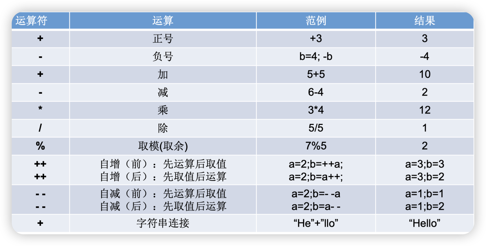
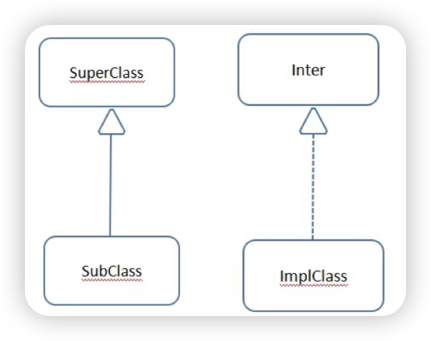

# Java基础语法

## 预备知识

### Java语言的特点

- 面向对象
  - 两个基本概念：类、对象
  - 三大特性：封装、继承、多态
- 健壮性
  - 吸收了C/C++语言的优点，但去掉了其影响程序健壮性的部分（如指针、内存的申请与 释放等），提供了一个相对安全的内存管理和访问机制
- 跨平台性
  - 跨平台性：通过Java语言编写的应用程序在不同的系统平台上都可以运行
  - 原理：只要在需要运行 java 应用程序的操作系统上，先安装一个Java虚拟机 ( JVM Java Virtual Machine ) 即可。由 JVM 来负责 Java 程序在该系统中的运行


### Java两种核心机制

#### Java虚拟机

- JVM是一个虚拟的计算机，具有指令集并使用不同的存储区域。负责执行指 令，管理数据、内存、寄存器
- 对于不同的平台，有不同的虚拟机
- 只有某平台提供了对应的java虚拟机，java程序才可在此平台运行
- Java虚拟机机制屏蔽了底层运行平台的差别，实现了“ 一次编译，到处运行 ”

#### 垃圾收集机制

- Java 语言消除了程序员回收无用内存空间的责任：它提供一种系统级线程跟踪存储空 间的分配情况。并在JVM空闲时，检查并释放那些可被释放的存储空间

##### GC

- GC 是垃圾收集的意思（Gabage Collection），内存处理是编程人员容易出现问题的地方， 忘记或者错误的内存回收会导致程序或系统的不稳定甚至崩溃，Java 提供的 GC 功能可以自动监测对象是否超过作用域从而达到自动回收内存的目的，Java 语言没有提供释放已分配内存的显示操作方法
- 对于 GC 来说，当程序员创建对象时，GC 就开始监控这个对象的地址、大小以及使用情况。通常，GC 采用有向图的方式记录和管理堆 ( heap ) 中的所有对象。通过这种方式确定哪些对象是" 可达的 "，哪些对象是" 不可达的 ”
- 当 GC 确定一些对象为" 不可达 "时，GC 就有责任回收这些内存空间。程序员可以手动执行 System.gc( )，通知 GC 运行，但是 Java 语言规范并不保证 GC 一定会执行
- 将垃圾对象所占用的堆内存进行回收 Java 的垃圾回收机制是 JVM 提供的能力，由单独的系统级垃圾回收线程在空闲时间以不定时的方式动态回收


### JDK、JRE、JVM关系


### 编写步骤

1. 将 Java 代码编写到扩展名为 .java 的文件中
2. 通过 javac 命令对该 java 文件进行编译
3. 通过 java 命令对生成的 class 文件进行运行


### 注释

#### 注释的好处

- 提高了代码的阅读性
- 调试程序的重要方法

#### Java中的注释类型

- 单行注释

  - 格式： //注释文字

- 多行注释

  - 格式：

    /* 注释文字 */

- 文档注释

  - 格式：/**

    ​	@author 指定java程序的作者

    ​	 @version 指定源文件的版本

    */

  - 注释内容可以被JDK提供的工具 javadoc 所解析，生成一套以网页文件形 式体现的该程序的说明文档

> 对于单行和多行注释，被注释的文字，不会被JVM（java虚拟机）解释执行
>
>  多行注释里面不允许有多行注释嵌套


## Java基本语法

### 关键字与保留字

#### 关键字

##### 定义

- 被Java语言赋予了特殊含义，用做专门用途的字符串（单词）

##### 特点

- 关键字中所有字母都为小写


#### 保留字

- 现有Java版本尚未使用，但以后版本可能会作为关键字使 用。自己命名标识符时要避免使用这些保留字
- goto 、const


### 标识符

- Java 对各种变量、方法和类等要素命名时使用的字符序列称为标识符

#### 定义合法标识符规则

- 由26个英文字母大小写，0-9 ，_或 $ 组成
- 数字不可以开头
- 不可以使用关键字和保留字，但能包含关键字和保留字
- Java中严格区分大小写，长度无限制
- 标识符不能包含空格

#### Java中的名称命名规范

##### 包名

- 多单词组成时所有字母都小写：xxxyyyzzz

##### 类名、接口名

- 多单词组成时，所有单词的首字母大写：XxxYyyZzz

##### 变量名、方法名

- 多单词组成时，第一个单词首字母小写，第二个单词开始每个 单词首字母大写：xxxYyyZzz

##### 常量名

- 所有字母都大写。多单词时每个单词用下划线连接：XXX_YYY_ZZZ

> 在起名字时，为了提高阅读性，要尽量有意义，“见名知意”
>
> Java采用unicode字符集，因此标识符也可以使用汉字声明，但是不建议使用


### 变量

#### 概念

- 内存中的一个存储区域
- 该区域的数据可以在同一类型范围内不断变化
- 变量是程序中最基本的存储单元。包含变量类型、变量名和存储的值

#### 作用

- 用于在内存中保存数据

> Java中每个变量必须先声明，后使用 
>
> 使用变量名来访问这块区域的数据 
>
> 变量的作用域：其定义所在的一对{ }内 
>
> 变量只有在其作用域内才有效 
>
> 同一个作用域内，不能定义重名的变量


#### 变量的分类

##### 按数据类型


##### 按声明的位置不同

- 在方法体外，类体内声明的变量称为成员变量
- 在方法体内部声明的变量称为局部变量


> 局部变量除形参外，需显式初始化


#### 变量的类型

##### 整数类型

- Java各整数类型有固定的表数范围和字段长度，不受具体OS的影响，以保证java程序的可移植性
- java的整型常量默认为 int 型，声明long型常量须后加‘ l ’或‘ L ’
- java程序中变量通常声明为int型，除非不足以表示较大的数，才使用long


> bit 是计算机中的最小存储单位
>
> byte 是计算机中基本存储单元


##### 浮点型

- 与整数类型类似，Java 浮点类型也有固定的表数范围和字段长度，不受具体操作系统的影响
- 浮点型常量有两种表示形式
  - 十进制数形式：如：5.12 科学计数法形式:如：5.12e2 、512.0f、.512(必须有小数点）
  - 科学计数法形式:如：5.12e、100E-2、521E2

##### float

- 单精度，尾数可以精确到7位有效数字。很多情况下，精度很难满足需求

##### double

- 双精度，精度是float的两倍。通常采用此类型
- Java 的浮点型常量默认为double型，声明float型常量，须后加‘ f ’或‘ F ’


##### 字符型

- char 型数据用来表示通常意义上“ 字符 ”( 2字节 )
- Java中的所有字符都使用Unicode编码，故一个字符可以存储一个字母，一个汉字，或其他书面语的一个字符
- 字符型变量的三种表现形式
  - 字符常量是用单引号 (‘  ’) 括起来的单个字符。例如：char c1 = 'a'；char = ‘中’ ；char c3 = ' 9 ';
  - Java中还允许使用转义字符 ‘ \  ’ 来将其后的字符转变为特殊字符型常量。 例如：char c3 = ‘\n’; // '\n'表示换行符
  - 直接使用 Unicode 值来表示字符型常量：‘\uXXXX’。其中，XXXX代表 一个十六进制整数。如：\u000a 表示 \n
- char类型是可以进行运算的。因为它都对应有Unicode码


##### 布尔类型

- boolean 类型用来判断逻辑条件，一般用于程序流程控制
- boolean类型数据只允许取值true和false，无null
  - 不可以使用0或非 0 的整数替代false和true，这点和C语言不同
  - Java虚拟机中没有任何供boolean值专用的字节码指令，Java语言表达所操作的 boolean值，在编译之后都使用java虚拟机中的int数据类型来代替：true用1表示，false 用0表示

##### 字符串类型

- String不是基本数据类型，属于引用数据类型
- 使用方式与基本数据类型一致
- 一个字符串可以串接另一个字符串，也可以直接串接其他类型的数据


#### 基本数据类型转换

##### 自动类型转换

- 容量小的类型自动转换为容量大的数据类型


- 有多种类型的数据混合运算时，系统首先自动将所有数据转换成容量最大的那种数据类型，然后再进行计算
- byte，short，char之间不会相互转换，他们三者在计算时首先转换为int类型
- boolean类型不能与其它数据类型运算
- 当把任何基本数据类型的值和字符串(String)进行连接运算时(+)，基本数据类 型的值将自动转化为字符串(String)类型


#### 强制类型转换

- 自动类型转换的逆过程，将容量大的数据类型转换为容量小的数据类型。使用时要加上强制转换符：( )，但可能造成精度降低或溢出,格外要注意
- 通常，字符串不能直接转换为基本类型，但通过基本类型对应的包装类则可以实现把字符串转换成基本类型

> boolean类型不可以转换为其它的数据类型


#### 进制

- 所有数字在计算机底层都以二进制形式存在
- 对于整数，有四种表示方式
  - 二进制(binary)：0,1 ，满2进1。以0b或0B开头
  - 十进制(decimal)：0-9 ，满10进1
  - 八进制(octal)：0-7 ，满8进1。以数字0开头表示
  - 十六进制(hex)：0-9及A-F，满16进1。 以0x或0X开头表示。此处的A-F不区分大小写

##### 二进制

- Java整数常量默认是int类型，当用二进制定义整数时，其第32位是符号位； 当是long类型时，二进制默认占64位，第64位是符号位
- 二进制的整数有如下三种形式
  - 原码：直接将一个数值换成二进制数。最高位是符号位
  - 负数的反码：是对原码按位取反，只是最高位（符号位）确定为1
  - 负数的补码：其反码加1
- 计算机以二进制补码的形式保存所有的整数
  - 正数的原码、反码、补码都相同
  - 负数的补码是其反码 +1


### 运算符

#### 算术运算符



> 如果对负数取模，可以把模数负号忽略不记，如：5 % -2 = 1。 但被模数是负数则不可忽略。此外，取模运算的结果不一定总是整数
>
> 对于除号“ / ”，它的整数除和小数除是有区别的
>
> “ + ”除字符串相加功能外，还能把非字符串转换成字符串

#### 赋值运算符

- 当“ = ”两侧数据类型不一致时，可以使用自动类型转换或 类型转换原则进行处理
- 支持连续赋值

#### 比较运算符


> 比较运算符的结果都是boolean型，也就是要么是true，要么是false
>
> 比较运算符“ == ”不能误写成“ = ”

#### 逻辑运算符


- “ & ”和“ && ”的区别
  - 单&时，左边无论真假，右边都进行运算
  - 双&时，如果左边为真，右边参与运算，如果左边为假，那么右边不参与运算
- “ | ”和“ || ”的区别同理
  - ||表示：当左边为真，右边不参与运算
  - ｜表示：左边无论真假，右边都进行运算


#### 面试题

```java
class test {
    public static void main (String [] args) {
        boolean x = false;
        boolean y = true;
        short z = 42;
        if((z++ == 42) && (y = true))
            z++;
        if((x = false) || (++z == 45))
            z++;
        System.out.println("z = " + z);
    }
 }
```

```结果
z = 46
```


#### 位运算符


- 位运算是直接对整数的二进制进行的运算

> 没有：<<<

#### 三元运算符


- 表达式1和表达式2为同种类型
- 三元运算符与if-else的联系与区别
  - 三元运算符可简化if-else语句
  - 三元运算符要求必须返回一个结果
  - if后的代码块可有多个语句


### 流程控制

- 流程控制语句是用来控制程序中各语句执行顺序的语句，可以把语句组合成能完成一定功能的小逻辑模块
- 其流程控制方式采用结构化程序设计中规定的三种基本流程结构
  - 顺序结构
  - 分支结构
  - 循环结构

#### 顺序结构

- 程序从上到下逐行地执行，中间没有任何判断和跳转


#### 分支结构

##### if - else

- 条件表达式必须是布尔表达式（关系表达式或逻辑表达式）、布尔变量
- 语句块只有一条执行语句时，一对{}可以省略，但建议保留
- if-else语句结构，根据需要可以嵌套使用
- 当if-else结构是“多选一”时，最后的else是可选的，根据需要可以省略
- 当多个条件是“互斥”关系时，条件判断语句及执行语句间顺序无所谓
- 当多个条件是“包含”关系时，“小上大下 / 子上父下”


##### switch

- switch(表达式)中表达式的值必须是下述几种类型之一：byte，short， char，int，枚举 (jdk 5.0)，String (jdk 7.0)
- case子句中的值必须是常量，不能是变量名或不确定的表达式值
- 同一个switch语句，所有case子句中的常量值互不相同
- break语句用来在执行完一个case分支后使程序跳出switch语句块；如 果没有break，程序会顺序执行到switch结尾
- default子句是可任选的。同时，位置也是灵活的。当没有匹配的case时， 执行default


#### 循环结构


#### 特殊流程控制语句

##### break

- break只能用于switch语句和循环语句中

- break语句用于终止某个语句块的执行

  > ```java
  > {
  > 	......
  >     break; 
  >    	......
  > }
  > ```
  >
  > 

- break语句出现在多层嵌套的语句块中时，可以通过标签指明要终止的是 哪一层语句块

  > ```java
  > label1: {  ......
  > 
  > 	label2:	{ ......
  > 
  > 		label3:{ 	......
  > 					break label2;
  >            			 ......
  > 				}
  > 			}
  > 		}
  > ```
  >
  > 


##### continue

- continue只能使用在循环结构中
- continue语句用于跳过其所在循环语句块的一次执行，继续下一次循环
- continue语句出现在多层嵌套的循环语句体中时，可以通过标签指明要跳过的是哪一层循环

> continue是终止本次循环，break是终止本层循环
>
> break、continue之后不能有其他的语句，因为程序永远不会执行其后的语句
>
> 标号语句必须紧接在循环的头部。标号语句不能用在非循环语句的前面


##### return

- 并非专门用于结束循环的，它的功能是结束一个方法。 当一个方法执行到一个return语句时，这个方法将被结束
- 与break和continue不同的是，return直接结束整个方法，不管 这个return处于多少层循环之内


### 数组

#### 数组的概述

- 数组本身是引用数据类型，而数组中的元素可以是任何数据类型，包括基本数据类型和引用数据类型
- 创建数组对象会在内存中开辟一整块连续的空间，而数组名中引用的是这块连续空间的首地址
- 数组的长度一旦确定，就不能修改
- 可以直接通过下标(或索引)的方式调用指定位置的元素，速度很快
- 数组的分类
  - 按照维度：一维数组、二维数组、三维数组、…
  - 按照元素的数据类型分：基本数据类型元素的数组、引用数据类型元素的数组(即对象数组)


#### 一维数组的使用

- 定义并用运算符new为之分配空间后，才可以引用数组中的每个元素
- 每个数组都有一个属性length指明它的长度，例如：a.length 指明数组a的长度(元素个数)

> 数组一旦初始化，其长度是不可变的

- 数组是引用类型，它的元素相当于类的成员变量，因此数组一经 分配空间，其中的每个元素也被按照成员变量同样的方式被隐式 初始化

> 对于基本数据类型而言，默认初始化值各有不同
>
> 对于引用数据类型而言，默认初始化值为null


#### 多维数组的使用

- 从数组底层的运行机制来看，其实没 有多维数组
- 每个一维数组都是默认初始化值null

> 注意特殊写法情况：int[ ] x,y[ ]; x是一维数组，y是二维数组
>
> Java中多维数组不必都是规则矩阵形式


#### Arrays 工具类的使用

- java.util.Arrays 类即为操作数组的工具类，包含了用来操作数组（比如排序和搜索）的各种方法

```java
public class SortTest {
    public static void main(String[] args) {
        int [] numbers = new int[]{12,32,14,65,32,24};
        Arrays.sort(numbers);
        for (int i = 0; i < numbers.length; i++) {
            System.out.println(numbers[i]);
        }
    }
}
```


#### 数组使用中的常见异常

##### 数组脚标越界异常(ArrayIndexOutOfBoundsException)

```java
int[] arr = new int[2]; 
System.out.println(arr[2]); 
System.out.println(arr[-1]); 
//访问到了数组中的不存在的脚标时发生。
```


##### 空指针异常(NullPointerException)

```java
int[] arr = null; 
System.out.println(arr[0]); 
//arr引用没有指向实体，却在操作实体中的元素时。
```


#### 面试题

```题目1
创建一个长度为 6 的 int 型数组，要求取值为 1-30，同时元素值各不相同
```


```java
public class ArrayExer_1 {
    public static void main(String[] args) {
        int[] array = new int[6];
        
        for (int i = 0; i < array.length; i++) {
            array[i] = (int) (Math.random() * 30) + 1;
            
            for (int j = 0; j < i; j++) {
                if (array[i] == array[j]) {
                    i--;
                    break;
                }
            }
        }
        
        for (int i = 0; i < array.length; i++) {
            System.out.println(array[i]);
        }
        
    }
}
```


```题目2
 从键盘输入一个整数（1~20） 
 则以该数字为矩阵的大小，把 1,2,3 … n * n 的数字按照顺时针螺旋的形式填入其中。
  例如：输入数字 2，
  则程序输出： 1 2 
             4 3 
  输入数字 3，
  则程序输出： 1 2 3 
             8 9 4  
             7 6 5
```


## 面向对象编程

### 面向过程（POP）与面向对象（OOP）

- 二者都是一种思想，面向对象是相对于面向过程而言的。面向过程，强调的是功能行为，以函数为最小单位，考虑怎么做。
- 面向对象，将功能封装进对象，强调具备了功能的对象，以类/对象为最小单位，考虑谁来做
- 面向对象更加强调运用人类在日常的思维逻辑中采用的思想方法与原则，如 抽象、分类、继承、聚合、多态等

#### 面向对象的三大特征

- 封装 (Encapsulation)
  - 封装是把过程和数据包围起来，对数据的访问只能通过已定义的界面
  - 面向对象计算始于这个基本概念，即现实世界可以被描绘成一系列完全自治、封装的对象， 这些对象通过一个受保护的接口访问其他对象

- 继承 (Inheritance)
  - 继承是一种联结类的层次模型，并且允许和鼓励类的重用，它提供了一种明确表述共性的方法
  - 对象的一个新类可以从现有的类中派生，这个过程称为类继承
  - 新类继承了原始类的特性，新类称为原始类的派生类（子类），而原始类称为新类的基类（父类）
  - 派生类可以从它的基类那里继承方法和实例变量，并且类可以修改或增加新的方法使之更适合特殊的需要

- 多态 (Polymorphism)
  - 多态性是指允许不同类的对象对同一消息作出响应
  - 多态性包括参数化多态性和包含多态性
  - 多态性语言具有灵活、抽象、行为共享、代码共享的优势，很好的解决了应用程序函数同名问题

- 抽象
  - 目标有关的方面。抽象并不打算了解全部问题，而只是选择其中的一部分，暂时不用部分细节
  - 抽象包括两个方面，一是过程抽象，二是数据抽象


### 对象的创建和使用

#### 类的访问机制

- 在一个类中的访问机制： 类中的方法可以直接访问类中的成员变量

> static方法访问非static，编译不通过

- 在不同类中的访问机制： 先创建要访问类的对象 ，再用对象访问类中 定义的成员


#### 内存解析

##### 堆

- 此内存区域的唯一目的 就是 存放对象实例 ， 几乎所有的对象实例都在这里分配内存
- 此内存区域的唯一目的 就是存放对象实例 ， 几乎所有的对象实例都在这里分配内存


##### 虚拟机栈

- 虚拟机栈用于存储局部变量等
- 局部变量表存放了编译期可知长度的各种基本数据类型（boolean、byte 、 char 、 short 、 int 、 float 、 long 、 double ） 、 对象引用（ reference 类型 ， 它不等同于对象本身 ， 是对象在堆内 存的首地址）
- 方法执行完，自动释放


##### 方法区

- 用于存储被虚拟机加载的类信息 、常量 、 静态变量 、 即时编译器编译后的代码等数据


#### 匿名对象

- 我们也可以不定义对象的句柄，而直接调用这个对象的方法。这样的对象叫做匿名对象
  - new Person().shout();
- 使用情况
  - 如果对一个对象只需要进行一次方法调用，那么就可以使用匿名对象
  - 我们经常将匿名对象作为实参传递给一个方法调用


### 方法

- 方法被调用一次，就会执行一次
- 没有具体返回值的情况，返回值类型用关键字void表示，那么方法体中可以不必使用return语句。如果使用，仅用来结束方法
- 定义方法时，方法的结果应该返回给调用者，交由调用者处理
- 方法中只能调用方法或属性，不可以在方法内部定义方法


#### 方法的重载

##### 重载的概念

- 在同一个类中，允许存在一个以上的同名方法，只要它们的参数个数或者参数 类型不同即可


##### 重载的特点

- 与返回值类型无关，只看参数列表，且参数列表必须不同 (参数个数或参数类型)。调用时，根据方法参数列表的不同来区别


##### 重载示例

```java
//返回两个整数的和 
int add(int x,int y)
{
    return x+y;
} 
//返回三个整数的和 
int add(int x,int y,int z)
{
    return x+y+z;
} 
//返回两个小数的和 
double add(double x,double y)
{
    return x+y;
}
```


#### 可变个数的形参

- JavaSE 5.0 中提供了Varargs (variable number of arguments) 机制，允许直接定义能和多个实参相匹配的形参。从而，可以用一种更简单的方式，来传递个数可变的实参

```java
//JDK 5.0以前：采用数组形参来定义方法，传入多个同一类型变量 
public static void test(int a ,String[] books); 
//JDK5.0：采用可变个数形参来定义方法，传入多个同一类型变量 
public static void test(int a ,String…books);
```


##### 说明

- 声明格式：方法名(参数的类型名 ...参数名)
- 可变参数：方法参数部分指定类型的参数个数是可变多个：0个，1个或多个
- 可变个数形参的方法与同名的方法之间，彼此构成重载
- 可变参数方法的使用与方法参数部分使用数组是一致的
- 方法的参数部分有可变形参，需要放在形参声明的最后
- 在一个方法的形参位置，最多只能声明一个可变个数形参


#### 方法参数的值传递机制

- 方法，必须由其所在类或对象调用才有意义。若方法含有参数
  - 形参：方法声明时的参数
  - 实参：方法调用时实际传给形参的参数值
- Java里方法的参数传递方式只有一种：值传递。 即将实际参数值的副本传入方法内，而参数本身不受影响
  - 形参是基本数据类型：将实参基本数据类型变量的“ 数据值 ”传递给形参
  - 形参是引用数据类型：将实参引用数据类型变量的“ 地址值 ”传递给形参


#### 方法的重写

##### 定义

- 在子类中可以根据需要对从父类中继承来的方法进行改造，也称为方法的重置、覆盖
- 在程序执行时，子类的方法将覆盖父类的方法


##### 要求

- 子类重写的方法必须和父类被重写的方法具有相同的方法名称、参数列表
- 子类重写的方法的返回值类型不能大于父类被重写的方法的返回值类型
- 子类重写的方法使用的访问权限不能小于父类被重写的方法的访问权限
  - 子类不能重写父类中声明为private权限的方法
- 子类方法抛出的异常不能大于父类被重写方法的异常

> 子类与父类中同名同参数的方法必须同时声明为非static的(即为重写)，或者同时声明为 static的（不是重写）
>
> 因为static方法是属于类的，子类无法覆盖父类的方法


```java
public class Person { 
    public String name; 
    public int age; 
    public String getInfo() { 
        return "Name: "+ name + "\n" +"age: "+ age; 
    } 
} 

public class Student extends Person { 
    public String school; 
    public String getInfo() { 
        return "Name: "+ name + "\nage: "+ age + "\nschool: "+ school; 
    }
}

public static void main(String[]args){
    Student s1 = new Student();
    s1.name = "LYZ";
    s1.school = "school2";
    System.out.println(s1.getInfo());
}

```


### 封装和隐藏

- 我们程序设计追求“ 高内聚，低耦合 ”
  - 高内聚 ：类的内部数据操作细节自己完成，不允许外部干涉
  - 低耦合 ：仅对外暴露少量的方法用于使用
- 隐藏对象内部的复杂性，只对外公开简单的接口。便于外界调用，从而提高系统的可扩展性、可维护性


#### 四种访问权限修饰符

- Java权限修饰符置于类的成员定义前，用来限定对象对该类成员的访问权限


- 对于class的权限修饰只可以用public和default(缺省)


### 构造器（构造方法）

#### 构造器的特征

- 它具有与类相同的名称
- 它不声明返回值类型（与声明为void不同）
- 不能被static、final、synchronized、abstract、native修饰，不能有 return语句返回值


#### 构造器的作用

- 创建对象
- 给对象进行初始化


#### 构造器的分类

- 隐式无参构造器（系统默认提供）
- 显式定义一个或多个构造器（无参、有参）

> Java语言中，每个类都至少有一个构造器
>
> 默认构造器的修饰符与所属类的修饰符一致
>
> 一旦显式定义了构造器，则系统不再提供默认构造器
>
> 一个类可以创建多个重载的构造器
>
> 父类的构造器不可被子类继承


### 关键字

#### this

- 它在方法内部使用，即这个方法所属对象的引用
- 它在构造器内部使用，表示该构造器正在初始化的对象
- this 可以调用类的属性、方法和构造器
- 用this来区分属性和局部变量

##### 使用说明

- 在任意方法或构造器内，如果使用当前类的成员变量或成员方法可以在其前面添加this， 增强程序的阅读性。不过，通常我们都习惯省略this
- 当形参与成员变量同名时 如果在方法内或构造器内需要使用成员变量，必须添加this来表明该变量是类的成员变量
- 使用this访问属性和方法时，如果在本类中未找到，会从父类中查找
- this可以作为一个类中构造器相互调用的特殊格式

```java 
class Person{
    private String name ; 
    private int age ;
    public Person(){ 
        System.out.println("新对象实例化") ; 
    } 
    public Person(String name){
        this(); 
        this.name = name ; 
    } 
    public Person(String name,int age){
        this(name) ; 
        this.age = age; 
    } 
    public String getInfo(){
        return "姓名：" + name + "，年龄：" + age ; 
    }
}
```


> 可以在类的构造器中使用" this ( 形参列表 ) "的方式，调用本类中重载的其他的构造器
>
> 构造器中不能通过" this ( 形参列表 ) "的方式调用自身构造器
>
> 如果一个类中声明了n个构造器，则最多有 n - 1个构造器中使用了 " this( 形参列表 ) ”
>
> " this ( 形参列表 ) "必须声明在类的构造器的首行
>
> 在类的一个构造器中，最多只能声明一个" this ( 形参列表 ) " 


#### package

##### 包的作用

- 包帮助管理大型软件系统：将功能相近的类划分到同一个包中。比如：MVC的设计模式
- 包可以包含类和子包，划分项目层次，便于管理
- 解决类命名冲突的问题
- 控制访问权限


##### JDK 中主要的包介绍

- java.lang
  - 包含一些 Java 语言的核心类 ， 如 String 、 Math 、 Integer 、 System 和 Thread，提供常用功能
- java.net
  - 包含执行与网络相关的操作的类和接口
- java.io
  - 包含能提供多种输入/输出功能的类
- java.util
  - 包含一些实用工具类，如定义系统特性、接口的集合框架类、使用 期日历相关的函数
- Java.text
  - 包含了一些java格式化相关的类
- java.sql
  - 包含了java进行JDBC数据库编程的相关类/接口
- Java.awt
  - 包含了构成抽象窗口工具集（abstract window toolkits）的多个类，这 些类被用来构建和管理应用程序的图形用户界面(GUI)


#### import

- 为使用定义在不同包中的Java类，需用import语句来引入指定包层次下所需要的类或全部类 (.  * )

##### 注意

- 在源文件中使用import显式的导入指定包下的类或接口
- 声明在包的声明和类的声明之间
- 如果需要导入多个类或接口，那么就并列显式多个import语句即可
- 如果导入的类或接口是java.lang包下的，或者是当前包下的，则可以省略此import语句
- 如果在代码中使用不同包下的同名的类。那么就需要使用类的全类名的方式指明调用的是哪个类
- 如果已经导入java.a包下的类。那么如果需要使用a包的子包下的类的话，仍然需要导入
- import static组合的使用：调用指定类或接口下的静态的属性或方法


#### super

- 在 Java 类中使用super来调用父类中的指定操作：
  - super可用于访问父类中定义的属性 
  - super可用于调用父类中定义的成员方法 
  - super可用于在子类构造器中调用父类的构造器


##### 注意

- 尤其当子父类出现同名成员时，可以用super表明调用的是父类中的成员 
- super的追溯不仅限于直接父类 
- super和this的用法相像，this代表本类对象的引用，super代表父类的内存空间的标识


```java
class Person { 
    protected String name = "张三"; 
    protected int age; 
    public String getInfo() { 
        return "Name: " + name + "\nage: " + age; 
    } 
} 

class Student extends Person { 
    protected String name = "李四"; 
    private String school = "New Oriental"; 
    public String getSchool() { 
        return school; 
    } 
    public String getInfo() { 
        return super.getInfo() + "\nschool: " + school;
	}
} 

public class StudentTest {
	public static void main(String[] args) {
        Student st = new Student();
        System.out.println(st.getInfo()); 
    }
}
```


##### 调用父类的构造器

- 子类中所有的构造器默认都会访问父类中空参数的构造器 
- 当父类中没有空参数的构造器时 ，子类的构造器必须通过 this ( 参数列表 )或者super ( 参数列表 ) 语句指定调用本类或者父类中相应的构造器。同时，只能”二选一”，且必须放在构造器的首行 
- 如果子类构造器中既未显式调用父类或本类的构造器，且父类中又没有无参的构造器，则编译出错

```java
public class Person {
    private String name; 
    private int age; 
    private Date birthDate;
    public Person(String name, int age, Date d) {
        this.name = name; 
        this.age = age; 
        this.birthDate = d; 
    } 
    
    public Person(String name, int age) {
        this(name, age, null); 
    } 
    
    public Person(String name, Date d) {
        this(name, 30, d); 
    } 
    
    public Person(String name) {
        this(name, 30); 
    }
}
```

```java
public class Student extends Person {
    private String school; 
    
    public Student(String name, int age, String s) {
        super(name, age);
        school = s;
	} 
    
    public Student(String name, String s) { 
        super(name);
        school = s;
	} 
    
    // 编译出错: no super(),系统将调用父类无参数的构造器。 
    
    public Student(String s) {
        school = s;
	}
}
```


##### this 和 super 的区别


#### instance of 操作符

- x instanceof A：检验x是否为类A的对象，返回值为boolean型
  - 要求x所属的类与类A必须是子类和父类的关系，否则编译错误
  - 如果x属于类A的子类B，x instanceof A值也为true


##### 自动类型提升


#### native

- 使用 `native` 关键字说明这个方法是原生函数，也就是这个方法是用 `C/C++`等非` Java` 语言实现的，并且被编译成了 `DLL`，由 `java `去调用。

##### native方法使用

- java 使用起来非常方便，然而有些层次的任务用 java 实现起来不容易，或者我们对程序的效率很在意时，问题就来了。例如：有时 java 应用需要与 java 外面的环境交互。这是本地方法存在的主要原因，你可以想想 java 需要与一些底层系统如操作系统或某些硬件交换信息时的情况。本地方法正是这样一种交流机制： 它为我们提供了一个非常简洁的接口，而且我们无需去了解 java 应用之外的繁琐的细节。
- 一个 native method 方法可以返回任何 java 类型，包括非基本类型，而且同样可以进行异常控制。
- native method 的存在并不会对其他类调用这些本地方法产生任何影响，实际上调用这些方法的其他类甚至不知道它所调用的是一个本地方法。JVM 将控制调用本地方法的所有细节。
- 如果一个含有本地方法的类被继承，子类会继承这个本地方法并且可以用 java 语言重写这个方法（如果需要的话）。


### 继承性

- 多个类中存在相同属性和行为时，将这些内容抽取到单独一个类中， 那么多个类无需再定义这些属性和行为，只要继承那个类即可
- 此处的多个类称为子类 ( 派生类 )，单独的这个类称为父类 ( 基类或超类 )
- 子类继承了父类，就继承了父类的方法和属性
- 在子类中，可以使用父类中定义的方法和属性，也可以创建新的数据和方法
- 在 Java 中，继承的关键字用的是“ extends ”，即子类不是父类的子集， 而是对父类的“ 扩展 ”


#### 作用

- 继承的出现减少了代码冗余，提高了代码的复用性
- 继承的出现，更有利于功能的扩展
- 继承的出现让类与类之间产生了关系，提供了多态的前提

> 不要仅为了获取其他类中某个功能而去继承


#### 规则

- Java只支持单继承和多层继承，不允许多重继承
  - 一个子类只能有一个父类 
  - 一个父类可以派生出多个子类


### 多态性

- 对象的多态性：父类的引用指向子类的对象
  - 可以直接应用在抽象类和接口上
- Java引用变量有两个类型：编译时类型和运行时类型。编译时类型由声明该变量时使用的类型决定，运行时类型由实际赋给该变量的对象决定。简 称：编译时，看左边；运行时，看右边。
  - 若编译时类型和运行时类型不一致，就出现了对象的多态性
  - “看左边”：看的是父类的引用（父类中不具备子类特有的方法）
  -  “看右边”：看的是子类的对象（实际运行的是子类重写父类的方法）

> 子类可看做是特殊的父类 ， 所以父类类型的引用可以指向子类的对象：向上转型


- 一个引用类型变量如果声明为父类的类型，但实际引用的是子类对象，那么该变量就不能再访问子类中添加的属性和方法

> 属性是在编译时确定的，编译时 e 为 Person类型，没有school成员变量，因而编译错误


- 子类中定义了与父类同名同参数的方法，在多态情况下，将此时父类的方法称为虚拟方法，父类根据赋给它的不同子类对象，动态调用属于子类的该方法。这样的方法调用在编译期是无法确定的


#### 多态作用

- 提高了代码的通用性，常称作接口重用


#### 前提

- 需要存在继承或者实现关系 
- 有方法的重写


#### 成员方法

- 编译时：要查看引用变量 
- 运行时：调用实际new的对象所属的类中的重写方法


#### 成员变量

- 不具备多态性，只看引用变量所声明的类


# Object 类的使用

## 使用规范

- Object类是所有Java类的根父类
- 如果在类的声明中未使用 extends 关键字指明其父类 ，则默认父类 为 java.lang.Object 类

```java
public class Person { 
    ...
}

等价于

public class Person extends Object { 	...
}
```


## == 操作符 与 equals 方法

### == 操作符

#### 基本类型比较值

- 只要两个变量的值相等，即为true

#### 引用类型比较引用(是否指向同一个对象)

- 只有指向同一个对象时，==才 返回true

> 用“==”进行比较时，符号两边的数据类型必须兼容 ( 可自动转换的基本 数据类型除外 ) ，否则编译出错


### equals 方法

#### equals( )

- 所有类都继承了Object，也就获得了equals( )方法
- 还可以重写
- 当自定义使用 equals( ) 时，可以重写。用于比较两个对象的 “ 内容 ” 是否都相等


#### 特例

- 当用 equals() 方法进行比较时 ， 对类 File 、 String 、 Date 及包装类 （Wrapper Class）来说，是比较类型及内容而不考虑引用的是否是同一个对象
  - 原因：在这些类中重写了Object类的equals( ) 方法


#### 重写 equals ( ) 方法的原则

- 对称性
  - 如果 `x.equals( y )` 返回是 “` true` ” ， 那么 `y.equals( x )` 也应该返回是 “ `true` ”
- 自反性
  - `x.equals( x ) `必须返回是“`true`”
- 传递性
  - 如果 `x.equals( y )` 返回是“ `true` ”，而且`y.equals( z ) `返回是“true” 那么 `z.equals( x ) `也应该返回是“ `true` ”。
- 一致性
  - 如果 `x.equals ( y) `返回是“`true`”，只要x和y内容一直不变，不管你重复`x.equals(y)`多少次，返回都是`“true`”
  - 任何情况下，`x.equals ( null )` ，永远返回是“`false`”
  - `x.equals( 和x不同类型的对象 )`永远返回是“`false`”


### == 操作符与equals 的区别

- `== `既可以比较基本类型也可以比较引用类型。对于基本类型就是比较值，对于引用类型 就是比较内存地址
- `equals`的话，它是属于`java.lang.Object`类里面的方法，如果该方法没有被重写过默认也是`==`;我们可以看到`String`等类的`equals`方法是被**重写**过的，而且`String`类在日常开发中用的比较多，久而久之，形成了equals是比较值的错误观点
- 具体要看自定义类里有没有重写`Object`的`equals`方法来判断
- 通常情况下，重写`equals`方法，会比较类中的相应属性是否都相等


## toString( ) 方法

- `toString( )`方法在` Object类`中定义 ，其返回值是 `String`类型 ，返回类名和它的引用地址
- 在进行`String`与其它类型数据的连接操作时，自动调用 `toString( ) `方法

```java
Date now=new Date(); 
System.out.println(“now = ”+ now); 
//相当于 
System.out.println(“now = ”+ now.toString());
```

- 可以根据需要在用户自定义类型中重写`toString( )`方法

```java
//如String 类重写了toString()方法，返回字符串的值。
s1 =“ hello ”;
System.out.println(s1);
//相当于
System.out.println(s1.toString());
```

- 基本类型数据转换为`String`类型时，调用了对应包装类的`toString( )`方法


# 包装类(Wrapper) 的使用

- 针对八种基本数据类型定义相应的引用类型—包装类（封装类）
- 有了类的特点，就可以调用类中的方法，Java才是真正的面向对象


## 基本数据类型包装成包装类的实例——装箱

- 通过包装类的构造器实现

```java
int i = 500; 
Integer t = new Integer(i);
```

- 还可以通过字符串参数构造包装类对象

```java
Float f = new Float(“4.56”); 
Long l = new Long(“asdf”); 
//NumberFormatException
```


## 获得包装类对象中包装的基本类型变量

- 调用包装类的 `xxxValue( )` 方法

```java
boolean b = bObj.booleanValue();
```


- JDK1.5之后，支持自动装箱，自动拆箱。但类型必须匹配

  


## 字符串转换成基本数据类型

- 通过包装类的构造器实现

```java
int i = new Integer(“12”);
```

- 通过包装类的` parseXxx(String s)` 静态方法

```java
Float f = Float.parseFloat(“12.1”);
```


## 基本数据类型转换成字符串

- 调用字符串重载的`valueOf( )`方法

```java
String fstr = String.valueOf(2.34f);
```

- 更直接的方式

```java
String intStr = 5 + “”;
```


## 举例

```java
int i = 500;
Integer t = new Integer(i); 
//装箱：包装类使得一个基本数据类型的数据变成了类。 
//有了类的特点，可以调用类中的方法。 
String s = t.toString(); 
// s = “500“,t是类，有toString方法 String s1 = Integer.toString(314); 
// s1= “314“ 将数字转换成字符串。

String s2=“4.56”;
double ds=Double.parseDouble(s2);
//将字符串转换成数字
```


```java
//拆箱：将数字包装类中内容变为基本数据类型。 
int j = t.intValue(); 
// j = 500，intValue取出包装类中的数据
//包装类在实际开发中用的最多的在于字符串变为基本数据类型。 
String str1 = "30" ; 
int x = Integer.parseInt(str1) ; 
// 将字符串变为int型 
float f = Float.parseFloat(str2) ; 
// 将字符串变为int型
```


# 类与类之间的关系


## 依赖关系

- 对象之间最弱的一种关联方式，是临时性的关联。代码中一般指由局部变量、函数参数、返回值建立的对于其他对象的调用关系

### 例如

```java
class A{
    public B method(C c , D d){
        E e = new E();
       	......
        B b = new B();
        ......
        return b;
    }
}
```


## 关联关系

- 对象之间一种引用关系，比如客户类与订单类之间的关系。这种关系通常使用类的属性表达。关联可以有方向，即导航。一般不作说明的时候，导航是双向的，不需要在线上标出箭头。
- 关联表示类之间的“ 持久 ”关系，这种关系一般表示一种重要的业务之间的关系，需要保存的，或者说需要“ 持久化 ”的，或者说需要保存到数据库中的。另外，依赖表示类之间的是 一种“临时、短暂”关系，这种关系是不需要保存的


### 例如

```java
class Employee{
    private int eid;
    private String name;
    private Computer computer;
}

class Computer{
    
}
```


```java
class Husband{
    private Wife wife;
}
class Wife{
    private Husband husband;
}
```


## 聚合

- 聚合（关联关系的一种）：表示 has-a 的关系。与关联关系一样，聚合关系也是通过实例变量来实现这样关系的。关联关系和聚合关系来语法上是没办法区分的，从语义上才能更好的 区分两者的区别。


### 例如

```java
class Car{
    private Engine engine;
    private Tyre[] tyres; 
}
```


### 关联和聚集的区别

- 关联关系所涉及的两个对象是处在同一个层次上的。比如人和自行车就是一种关联关系，而不是聚合关系，因为人不是由自行车组成的。
- 聚合关系涉及的两个对象处于不平等的层次上，一个代表整体，一个代表部分。比如电脑和它的显示器、键盘、主板以及内存就是聚集关系，因为主板是电脑的组成部分。


## 组合

- 对象 A 包含对象 B，对象 B 离开对象 A 没有实际意义。是一种更强的关联关系。人包含手， 手离开人的躯体就失去了它应有的作用。
- 组合：表示 contains-a 的关系，是一种强烈的包含关系。组合类负责被组合类的生命周期。 也使用属性表达组合关系，是关联关系的一种，是比聚合关系强的关系。


### 例如

```java
class Window{
    private Menu menu;
    private Slider slider;
    private Panel panel;
}
```


## 继承

- 类与类的继承关系
- 类与接口之间的实现关系




# 设计模式

### JavaBean

- JavaBean是一种Java语言写成的可重用组件
- 所谓javaBean，是指符合如下标准的Java类：
  - 类是公共的
  - 有一个无参的公共的构造器
  - 有属性，且有对应的get、set方法
- 用户可以使用JavaBean将功能、处理、值、数据 用Java代码创造的对象进行打包，并且其他的开发者可以通过内部的JSP 页面、Servlet、其他JavaBean、applet程序或者应用来使用这些对象。
- 用 户可以认为JavaBean提供了一种随时随地的复制和粘贴的功能，而不用关心任何改变。


#### Java Bean示例

```java
public class JavaBean {

	private String name; // 属性一般定义为private 
    private int age; 
    public JavaBean() { 
    } 
    public int getAge() {
		return age; 
    } 
    public void setAge(int a){ 
        age = a;
    } 
    public String getName() {
		return name; 
    } 
    public void setName(String n) { 
        name = n;
    }
}
```


## MVC模式

- MVC是常用的设计模式之一，将整个程序分为三个层次：视图模型层，控制器层，与数据模型层
- 这种将程序输入输出、数据处理，以及数据的展示分离开来的设计模式使程序结构变的灵活而且清晰，同时也描述了程序各个对象间的通信方式，降低了程序的耦合性


### 模型层 model 主要处理数据

- 数据对象封装 model.bean/domain
- 数据库操作类 model.dao
- 数据库 model.db


### 控制层 controller 处理业务逻辑

- 应用界面相关 controller.activity
- 存放fragment controller.fragment
- 显示列表的适配器 controller.adapter
- 服务相关的 controller.service
- 抽取的基类 controller.base


### 视图层 view 显示数据

- 相关工具类 view.utils
- 自定义view view.ui


